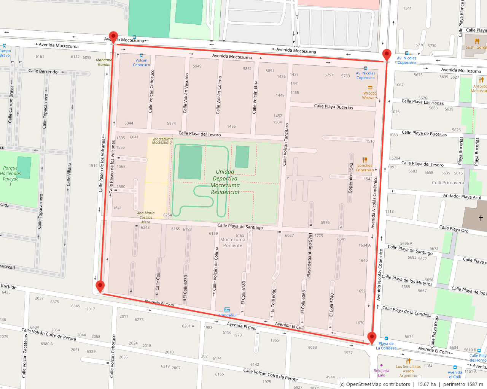
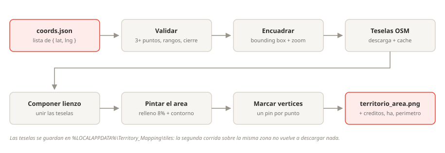
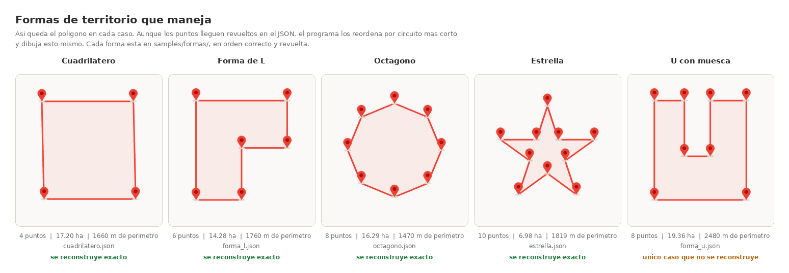

# Territory_Mapping

Convierte una lista de coordenadas en la imagen del area que cubren: toma el
mapa de la zona, pinta el poligono encima y marca cada vertice con un pin.



> Territorio de ejemplo en Zapopan, Jalisco, delimitado por Av. Moctezuma,
> Av. Nicolas Copernico, Av. El Colli y C. Paseo de los Volcanes. 15.67 ha.

---

## Que resuelve

Tienes las esquinas de un territorio en un JSON y necesitas la imagen para
imprimir, compartir o archivar. Este ejecutable la genera de un tiron, sin
abrir un navegador ni depender de ninguna cuenta.

- **No necesita API key ni cuenta.** El mapa sale de OpenStreetMap.
- **No necesita internet la segunda vez.** Las teselas quedan en cache local.
- **Un solo archivo.** `Territory_Mapping.exe`, sin instalador.

---

## Arranque rapido

### 1. Instala Python (solo para compilar)

Descarga Python 3 de <https://www.python.org/downloads/> y **marca la casilla
"Add python.exe to PATH"** durante la instalacion. Si no la marcas, `build.bat`
no va a encontrarlo.

### 2. Genera el ejecutable

Doble clic en **`build.bat`**. Crea el entorno virtual, instala Pillow y
PyInstaller, y compila. Tarda uno o dos minutos la primera vez.

El resultado queda en **`dist\Territory_Mapping.exe`**.

### 3. Pruebalo

Doble clic en **`probar.bat`**. Genera el mapa del territorio de ejemplo en
`salida\` y lo abre.

### 4. Usalo con tus coordenadas

```
dist\Territory_Mapping.exe -i mis_coordenadas.json
```

La imagen queda junto al ejecutable. Con `-o` eliges otra ruta.

---

## Como funciona



El programa proyecta las coordenadas a Web Mercator (la misma proyeccion que
usan Google Maps y OpenStreetMap), busca el **zoom mas cercano** en el que el
poligono todavia cabe en el lienzo con el margen pedido, y arma el fondo
pegando las teselas que hacen falta. Despues dibuja encima.

El contorno y los pines se dibujan en un lienzo a 4x y se reducen al final:
Pillow no tiene antialiasing, y ese es el truco para que los bordes no queden
escalonados. Los pines son geometria pura, no una imagen: escalan a cualquier
tamano sin pixelarse y el `.exe` no carga recursos externos.

### Cache de teselas

Las teselas se guardan en `%LOCALAPPDATA%\Territory_Mapping\tiles`. La primera
corrida sobre una zona descarga entre 6 y 30 imagenes; las siguientes sobre la
misma zona no piden nada a la red. Si quieres forzar la redescarga, borra esa
carpeta.

---

## Entrada

El JSON es **solo la lista de ubicaciones**, en el orden en que se recorre el
perimetro:

```json
[
  { "lat": 20.650872, "lng": -103.436386 },
  { "lat": 20.650639, "lng": -103.432531 },
  { "lat": 20.646900, "lng": -103.432741 },
  { "lat": 20.647579, "lng": -103.436573 }
]
```

| Regla | Detalle |
|---|---|
| Minimo | 3 puntos |
| Orden | El del arreglo: define el trazo del perimetro |
| Cierre | Implicito. No repitas el primer punto al final (si lo haces, se ignora) |
| Si no van en orden | Se corrige solo. Ver la seccion de abajo |
| Sentido | Indistinto, horario o antihorario |
| Tolerancias | Acepta `lon` y `long` ademas de `lng`, y pares `[lat, lng]` |

Detalle completo en [`docs/formato-json.md`](docs/formato-json.md).

### Que pasa si las coordenadas no estan en orden

Se corrige solo. No tienes que hacer nada.

El orden del arreglo **es** el trazo del perimetro, asi que unos puntos
revueltos producirian un poligono cruzado y un area equivocada: con el
territorio de ejemplo en desorden, daba 0.99 ha en vez de 15.67 ha. El programa
detecta los cruces y reordena antes de dibujar:

```
  orden   : corregido, circuito mas corto (1587 m vs 1899 m)
```



Asi queda el poligono en cada forma. Da igual si los puntos llegan revueltos en
el JSON: el programa los reordena y dibuja esto mismo. Las cinco estan en
`samples/formas/`, cada una en orden correcto y revuelta para que lo compruebes.

#### Como lo resuelve

Busca **el circuito cerrado mas corto que pasa por todos los puntos**. Eso es
el problema del agente viajero euclidiano, y aqui encaja por una propiedad
geometrica: el recorrido mas corto nunca se cruza consigo mismo. Si dos tramos
se cruzaran, descruzarlos dejaria un recorrido mas corto, por desigualdad
triangular. Es decir, **el circuito minimo es exactamente el poligono simple de
menor perimetro** sobre ese conjunto de puntos, y el perimetro de un territorio
real es el mas corto que los une.

- **Hasta 12 puntos**: solucion exacta por programacion dinamica (Held-Karp).
- **De 13 en adelante**: vecino mas cercano desde varios arranques, afinado con
  2-opt. Un optimo local de 2-opt no tiene cruces, asi que el resultado siempre
  es un poligono simple.

Medido: 80 puntos en 142 ms. En 500 nubes de puntos al azar, cero resultados
con cruces.

#### Que tan confiable es

| Forma | Puntos | Archivo | Recupera el original |
|---|---|---|---|
| Cuadrilatero (las 24 permutaciones) | 4 | `samples/formas/cuadrilatero.json` | Siempre |
| Forma de L | 6 | `samples/formas/forma_l.json` | 300 de 300 barajadas |
| Octagono | 8 | `samples/formas/octagono.json` | 300 de 300 barajadas |
| Estrella de 10 puntas | 10 | `samples/formas/estrella.json` | 300 de 300 barajadas |
| U con muesca profunda | 8 | `samples/formas/forma_u.json` | **No** |

Para probarlo tu mismo, corre cualquiera de los `_revuelto.json`:

```
dist\Territory_Mapping.exe -i samples\formas\forma_l_revuelto.json -o salida
```

**El limite** se ve en la ultima columna de la figura. Cuando el territorio
tiene una muesca angosta y profunda, el poligono mas corto no es el que tenias
en mente: la U de 19.36 ha se resolvio como una figura de 14.75 ha con 2121 m
de perimetro, contra los 2480 m del original. No se cruza y de verdad es mas
corta; simplemente **no es tu territorio**.

No es un bug del algoritmo: es que la informacion del orden se perdio y el
criterio de "mas corto" apunta a otro lado. Si tu territorio tiene un brazo o
una muesca marcada, capturalo en orden de recorrido, que es como deberia venir
de todos modos. Con `--sin-ordenar` el programa respeta el orden del JSON tal
cual y solo avisa si detecta cruces.

### De donde sacar las coordenadas

En Google Maps, clic derecho sobre el punto y la primera linea del menu son las
coordenadas: se copian al portapapeles con un clic. Repite en cada esquina del
territorio y pegalas en el JSON.

---

## Parametros

```
Territory_Mapping.exe -i <json> [-o <salida>] [opciones]
```

| Parametro | Default | Que hace |
|---|---|---|
| `-i`, `--input` | requerido | Ruta del JSON de coordenadas |
| `-o`, `--output` | junto al `.exe` | Archivo `.png`, o carpeta donde dejarlo |
| `--ancho` / `--alto` | `1280` / `1024` | Tamano de la imagen en pixeles |
| `--margen` | `8` | Porcentaje de aire alrededor del poligono |
| `--color` | `E94235` | Color del contorno, en RRGGBB |
| `--grosor` | `4` | Grosor del contorno en pixeles |
| `--opacidad` | `8` | Opacidad del relleno, 0 a 100. `0` deja solo el contorno |
| `--pin` | `34` | Alto del pin en pixeles |
| `--sin-pines` | apagado | No dibuja los marcadores |
| `--sin-ordenar` | apagado | No corrige el orden aunque el poligono se cruce |
| `--silencioso` | apagado | No imprime el avance |

**Si omites `-o`, la imagen queda junto al ejecutable**, con el nombre
`<nombre_del_json>_area.png`. Es lo comodo para arrastrar un JSON y listo.
Si esa carpeta fuera de solo lectura, avisa y la guarda en la carpeta actual.

Si `-o` termina en `.png`, `.jpg` o `.jpeg`, ese es el archivo. Si no, se trata
como carpeta y el archivo se llama `<nombre_del_json>_area.png`.

### Ejemplos

```bat
:: lo minimo: la imagen queda junto al .exe
Territory_Mapping.exe -i territorio.json

:: eligiendo carpeta
Territory_Mapping.exe -i territorio.json -o salida

:: solo contorno, sin sombreado
Territory_Mapping.exe -i territorio.json -o salida --opacidad 0

:: para imprimir, mas grande y con pines mas visibles
Territory_Mapping.exe -i territorio.json -o mapa.png --ancho 2400 --alto 1800 --pin 52

:: en azul, sin marcadores
Territory_Mapping.exe -i territorio.json -o salida --color 1A73E8 --sin-pines
```

---

## Paleta

| Elemento | Color |
|---|---|
| Contorno y cuerpo del pin | `#E94235` |
| Circulo interior del pin | `#B20D0D` |
| Relleno del area | `#E94235` al 8% |

El relleno usa el mismo rojo que el contorno, a muy baja opacidad: el area se
lee como un solo objeto y las calles, los nombres y los parques del mapa siguen
siendo legibles por debajo.

---

## Estructura

```
Territory_Mapping/
├── src/territory_mapping.py    codigo fuente (una sola dependencia: Pillow)
├── samples/                    JSON de ejemplo
│   └── formas/                 los cinco casos de ordenamiento
├── docs/                       formato, arquitectura, diagrama
├── build.bat                   genera dist\Territory_Mapping.exe
├── probar.bat                  corre el ejemplo y abre el resultado
└── requirements.txt
```

---

## Problemas comunes

| Sintoma | Causa y solucion |
|---|---|
| `build.bat` dice que no encuentra Python | No marcaste "Add python.exe to PATH" al instalar. Reinstala Python marcando la casilla |
| El mapa sale gris sin calles | No hubo conexion al descargar las teselas. Revisa internet y vuelve a correr: lo que ya se bajo queda en cache |
| `ERROR: se necesitan al menos 3 puntos` | El JSON tiene 2 puntos o menos, o no es un arreglo |
| `ERROR: el punto N tiene lat fuera de rango` | Invertiste `lat` y `lng`. En Mexico la latitud ronda 20 y la longitud -103 |
| El poligono sale deformado o en forma de mono | Solo pasa con `--sin-ordenar`. Quitalo y se corrige solo |
| Reordeno pero el resultado no es mi territorio | Tiene una muesca angosta y profunda. Captura los puntos en orden de recorrido |

---

## Estado

Funcionando: imagen del area a partir del JSON.

Pendiente del alcance original: la captura a nivel de calle de cada punto. Ver
[`docs/arquitectura.md`](docs/arquitectura.md) para la fuente elegida y por que.

---

## Creditos

Datos y teselas del mapa: **(c) OpenStreetMap contributors**, bajo
[ODbL](https://www.openstreetmap.org/copyright). La atribucion va estampada en
cada imagen que genera el programa.
